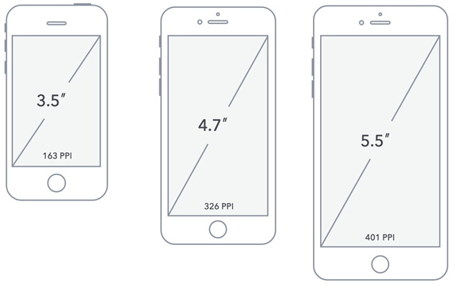
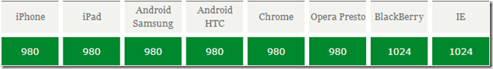
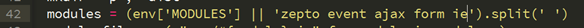

# 移动前端学习

## 第一章  基础知识

### 1.1  屏幕

>  移动设备与PC设备最大的差异在于屏幕，这主要体现在**屏幕尺寸**和**屏幕分辨率**两个方面。

+ 通常我们所指的**屏幕尺寸**，实际上指的是屏幕**对角线**的长度（一般用英寸来度量）如下图所示



+ 而**分辨率**则一般用**像素（px）**来度量，表示屏幕水平和垂直方向的像素数，例如1920\*1080指的是屏幕垂直方向和水平方向分别有1920和1080个像素点而构成，如下图所示


### 1.2  长度单位

​	在Web开发中可以使用`px（像素）、em、pt（点）、in（英寸）、cm（厘米）`做为长度单位，我们最常用`px（像素）`做为长度单位。

​	我们可以将上述的几种长度单位划分成<u>相对</u>长度单位和<u>绝对</u>长度单位。


​	如上图所示，iPhone3G/S和iPhone4/S的屏幕尺寸都为3.5英寸（in）但是屏幕分辨率却分别为480\*320px、960\*480px，由此我们可以得出英寸是一个绝对长度单位，而像素是一个相对长度单位（**像素并没有固定的长度**）。

### 1.3  1.1   像素密度

​	DPI（Dots Per Inch）是印刷行业中用来表示打印机每英寸可以喷的墨汁点数，计算机显示设备从打印机中借鉴了DPI的概念，由于计算机显示设备中的最小单位不是墨汁点而是像素，所以用PPI（Pixels Per Inch）值来表示屏幕每英寸的像素数量，我们将PPI、DPI都称为像素密度，但PPI应用更广泛，DPI在Android设备比较常见。

​	如下图所示，利用`勾股定理`我们可以计算得出PPI


​	结论：PPI值的越大说明单位尺寸里所能容纳的像素数量就越多，所能展现画面的品质也就越精细，反之就越粗糙。

​	Retina即视网膜屏幕，苹果注册的命名方式，意指具有较高PPI（大于320）的屏幕。

​	思考：在屏幕尺寸（英寸）固定时，PPI和像素大小的关系？

​	结论：屏幕尺寸固定时，当PPI 越大，像素的实际大小就会越小，当PPI越小，像素实际大小就越大。

### 1.4  1.1   设备独立像素

​	随着技术发展，设备不断更新，出现了不同PPI的屏幕共存的状态（如iPhone3G/S为163PPI，iPhone4/S为326PPI），像素不再是统一的度量单位，这会造成同样尺寸的图像在不同PPI设备上的显示大小不一样。

​	如下图，假设你设计了一个163\*163的蓝色方块，在PPI为$163\sqrt2$ 的屏幕上，那这个方块看起来正好就是1\*1寸大小，在PPI为$326\sqrt2​$的屏幕上，这个方块看起来就只有0.5*0.5寸大小了。


​	用户希望在不同PPI的设备上看到的图像内容差不多大小，所以这时我们需要一个新的单位，这个新的单位能够保证图像内容在不同的PPI设备看上去大小应该差不多，这就是独立像素，在IOS设备上叫PT(Point)，Android设备上叫DIP(Device independent Pixel)或DP。

​	举例说明就是iPhone 3G（PPI为163）1dp = 1px，iPhone 4（PPI为326）1dp = 2px。


​	我们也不难发现，如果想要iPhone 3G/S和iPhone 4/S图像内容显示一致，可以把iPhone 4/S的尺寸放大一倍（它们是一个2倍(@2x)的关系），即在iPhone3G/S的上尺寸为44\*44px，在iPhone4/S上为88\*88px，我们要想实现这样的结果可以设置44\*44dp，这时在iPhone3G/S上代表44\*44px，在iPhone4/S上代表88\*88px，最终可以看到的图像差不多大小。

​	通过上面例子我们不难发现dp同px是有一个对应（比例）关系的，这个对应（比例）关系是操作系统确定并处理，目的是确保不同PPI屏幕所能显示的图像大小是一致的，通过`window.devicePixelRatio`可以获得该比例值。

测试可得下面设备类型比例值

| PC   | Galaxy | iPhone 5/SE | iPad | Pixel 2 |
| ---- | ------ | ----------- | ---- | ------- |
| 1    | 3      | 2           | 2    | 2.625   |

​	下图展示了iPhone不同型号间dp和px的比例关系

                          

​	从上图我们得知dp（或pt）和px并不总是绝对的倍数关系（并不总能保证能够整除），而是window.devicePixelRatio ≈ 物理像素/独立像素，然而这其中的细节我们不必关心，因为操作系统会自动帮我们处理好（保证1dp在不同的设备上看上去大小差不多）。


### 1.5   像素

​	1、物理像素指的是屏幕渲染图像的最小单位，属于屏幕的物理属性，不可人为进行改变，其值大小决定了屏幕渲染图像的品质，我们以上所讨论的都指的是物理像素。

```js
// 获取屏幕的物理像素尺寸
window.screen.width;
window.screen.height;
```

部分移动设备下获取会有错误，与移动开发无关，只需要了解

​	2、CSS像素，与设备无关像素，指的是通过CSS进行网页布局时用到的单位，其默认值(PC端)是和物理像素保持一致的（1个单位的CSS像素等于1个单位的物理像素），但是我们可通缩放来改变其大小。

​	我们通过调整浏览器的缩放比例可以直观的理解CSS像素与物理像素之前的对应关系，如下图所示：


​	我们需要理解的是物理像素和CSS像素的一个关系，1个物理像素并不总是等于一个CSS像素，通过调整浏览器缩放比例，可以有以上3种情况。


## 第二章  远程调试

### 2.1  模拟调试

​	现代主流浏览器均支持移动开发模拟调试，通常按F12可以调起，其使用也比较简单，可以帮我们方便快捷定位问题。

### 2.2  真机调试

​	模拟调试可以满足大部分的开发调试任务，但是由于移动设备种类繁多，环境也十分复杂，模拟调试容易出现差错，所以真机调试变的非常必要。

​	有两种方法可以实现真机调试：

​	1、将做好的网页上传至服务器或者本地搭建服务器，然后移动设备通过网络来访问。（重点）

​	2、借助第三方的调试工具，如weinre、debuggap、ghostlab(比较)等，真机调试必须保证移动设备同服务器间的网络是相通的。


## 第三章  视口

> 视口（viewport）是用来约束网站中最顶级块元素<html>的，即它决定了<html>的大小。

### 3.1  PC设备

​	在PC设备上viewport的大小取决于浏览器窗口的大小，以CSS像素作为度量单位。

​	通过以往CSS的知识，我们都能理解\<html>的大小是会影响到我们的网页布局的，而viewport又决定了\<html>的大小，所以viewport间接的决定并影响了我们网页的布局。

```javascript
// 获取viewport的大小
document.documentElement.clientWidth;
document.documentElement.clientHeight;
```

​	下面我们通过一个代码实例来演示PC设备viewport（浏览器窗口）是如何影响我们的网页布局的，代码示例

```html
<!DOCTYPE html>
<html lang="en">
<head>
	<meta charset="UTF-8">
	<title>视口</title>
	<style>
		body {
			padding: 0;
			margin: 0;
			background-color: #F7F7F7;
		}

		.info {
			line-height: 20px;
			padding: 10px;
			background-color: pink;
		}

		.info span {
			display: block;
		}

		.viewport {
			/*1.如果确定具体的宽高 值，当超出viewport的大小的时候，会出现滚动条
			2.如果设置的宽度为100%,当子元素宽高大于父容器的时候，会自动换行
			3.如果不想出现滚动条或者换行，可以将子元素设置为父容器的百分比*/
			width: 100%;
			/*width: 1152px;*/
			height: 200px;
			background-color: #CCC;
		}

		.viewport .box {
			/*width: 288px;*/
			width: 25%;
			height: 200px;
			text-align: center;
			line-height: 200px;
			font-size: 28px;
			float: left;
			background-color: blue;
			border-right: 2px solid #ccc;
			box-sizing: border-box;
		}
	</style>
</head>
<body>
	<!-- 显示窗口信息 -->
	<div class="info">
		<span class="width"></span>
		<span class="height"></span>
	</div>

	<div class="viewport">
		<div class="box">1</div>
		<div class="box">2</div>
		<div class="box">3</div>
		<div class="box">4</div>
	</div>
	<!-- 一个类似jQuery的库 -->
	<script src="../js/zepto.js"></script>
	<script>

		var clientWidth, clientHeight;
		var width = $('.width'),
			height = $('.height');

		// 用来获取viewport
		function getSize() {
			clientWidth = document.documentElement.clientWidth;
			clientHeight = document.documentElement.clientHeight;

			width.text('PC设备Viewport的宽度为：' + clientWidth);
			height.text('PC设备Viewport的高度为：' + clientHeight);
		}

		// 调用
		getSize();

		// 监听窗口变化
		window.onresize = function () {
			getSize();
		}
	</script>
</body>
</html>
```

​	当我们调整浏览器窗口时，4个浮动的盒子换行显示了，原因是父盒子宽度不足以容纳4个子盒子，要解决这个问题可以给父盒子设置一个固定（较大）的宽度，如1152px，这样我们可以解决盒子不换行的问题，也可以保证我们的网页内容可以正常的显示，但是出现了滚动条。

注：所谓正常显示是指页面布局没有错乱。

总结：在PC端，我们通过调整浏览器窗口可以改变viewport的大小，为了保证网页布局不发生错乱，需要给元素设定较大固定宽度。

### 3.2  移动设备

​	移动设备屏幕普遍都是比较小的，但是大部分的网站又都是为PC设备来设计的，要想让移动设备也可以正常显示网页，移动设备不得不做一些处理，通过上面的例子我们可以知道只要viewport足够大，就能保证原本为PC设备设计的网页也能在移动设备上正常显示，移动设备厂商也的确是这样来处理的。

​	在移动设备上viewport不再受限于浏览器的窗口，而是允许开发人员自由设置viewport的大小，通常浏览 器会设置一个默认大小的viewport，为了能够正常显示那些专为PC设计的网页，一般这个值的大小会大于屏幕的尺寸。

如下图为常见默认viewport大小（仅供参考）



从图中统计我们得知不同的移动厂商分别设置了一个默认的viewport的值，这个值保证大部分网页可以正常在移动设备下浏览。

下面我们通过一个小示例来验证上述结论，执行环境为iPhone5s

在示例中我们设定.box{width: 490px;}了，发现两个盒子正好一行显示，代码示例

```html

<!DOCTYPE html>
<html lang="en">
<head>
    <meta charset="UTF-8">
    <title>视口</title>
    <style>
        body {
            padding: 0;
            margin: 0;
            background-color: #F7F7F7;
        }

        .box {
            width: 490px;
            height: 200px;
            text-align: center;
            line-height: 200px;
            background-color: pink;
            float: left;
        }
    </style>
</head>
<body>
<div class="box">1</div>
<div class="box">2</div>
</body>
</html>
```

设定了.box{width: 491px;}，则换行显示了

​	比较可以验证iPhone5s下viewport的默认宽为980px，这样便可以保证原本为PC设计的网页，在移动端上也不会发生布局的错乱。

注：早期网页一般宽度设计成960px。

​	我们再做另一个测试，正常PC设备适配的页面在iPhone5s和部分Android中我们发现页面内容（文字、图片）被缩放了（变的非常小），而在部分安卓设备中则出现了滚动条。

​	产生缩放和滚动条的原因是什么呢？

​	要解释上面的原因，需要进一步对移动设备的viewport进行分析，移动设备上有2个viewport（为了方便讲解人为定义的），分别是layout viewport和ideal viewport。

​	1、layout viewport（布局视口）指的是我们可以进行网页布局区域的大小，同样是以CSS像素做为计量单位，可以通过下面方式获取

```js
// 获取layout viewport
document.documentElement.clientWidth;
document.documentElement.clientHeight;
```

通过前面介绍我们知道，如果要保证为PC设计的网页在移动设备上布局不发生错乱，移动设备会默认设置一个较大的viewport（如IOS为980px），这个viewport实际指的是layout viewport。

2、ideal viewport（理想视口）设备屏幕区域，（以设备独立像素PT、DP做为单位）以CSS像素做为计量单位，其大小是不可能被改变，通过下面方式可以获取。

```js
// 获取ideal viewport有两种情形
// 新设备
window.screen.width;
window.screen.height;
// 老设备
window.screen.width / window.devicePixelRatio;
window.screen.height / window.devicePixelRatio;
```

​	并不总是正确的，然而在实际开发我们一般无需获取这个值具体大小。

​	理解两个viewport后我们来解释为什么网页会被缩放或出现水平滚动条，其原因在于移动设备浏览器会默认设置一个layout viewport，并且这个值会大于ideal viewport，那么我们也知道ideal viewport就是屏幕区域，layout viewport是我们布局网页的区域，那么最终layout viewport是要显示在ideal viewport里的，而layout viewport大于ideal viewport时，于是就出现滚动条了，那么为什么有的移动设备网页内容被缩放了呢？移动设备厂商认为将网页完整显示给用户才最合理，而不该出现滚动条，所以就将layout viewport进行了缩放，使其恰好完整显示在ideal viewport（屏幕）里，其缩放比例为ideal viewport / layout viewport。

### 3.3  移动浏览器

​	移动端开发主要是针对IOS和Android两个操作系统平台的，除此之外还有Windows Phone。

​	移动端主要可以分成三大类，系统自带浏览器、应用内置浏览器、第三方浏览器

​	系统浏览器：指跟随移动设备操作系统一起安装的浏览器。

​	应用内置浏览器：通常在移动设备上都会安装一些APP例如QQ、微信、微博、淘宝等，这些APP里往往会内置一个浏览器，我们称这个浏览器为应用内置浏览器（也叫WebView），这个内置的浏览器一般功能比较简单，并且客户端开发人员可以更改这个浏览器的某些设置。

​	第三方浏览器：指安装在手机的浏览器如FireFox、Chrome、360等等。

​	在IOS和Android操作系统上自带浏览器、应用内置浏览器都是基于Webkit内核的。

​	思考：移动端页面要达到什么效果才最合理？


## 第四章  屏幕适配

​	移动页面最理想的状态是，避免滚动条且不被默认缩放处理，我们可以通过设置\<meta name="viewport" content="">来进行控制，并改变浏览器默认的layout viewport的宽度。

### 4.1  Viewport详解

​	viewport 是由苹果公司为了解决移动设备浏览器渲染页面而提出的解决方案，后来被其它移动设备厂商采纳，其使用参数如下：

// 通过设置属性content=""实现，中间以逗号分隔

// 例如\<meta name="viewport" content="width=device-width">

width 设置layout viewport 宽度，其取值可为数值或者device-width。

height 设置layout viewport 高度，其取值可为数值或者device-height

initital-scale设置页面的初始缩放值，为一个数字，可以带小数。

maximum-scale允许用户的最大缩放值，为一个数字，可以带小数。

minimum-scale允许用户的最小缩放值，为一个数字，可以带小数。

user-scalable是否允许用户进行缩放，值为"no"或"yes"。

注：device-width 和 device-height就是ideal viewport的宽高。

webstorm快捷键：meta:vp+tab

### 4.2  控制缩放

1、设置\<meta name="viewport" content="initial-scale=1">，这时我们发现网页没有被浏览器设置缩放。

2、设置\<meta name="viewport" content="width=device-width">，这时我们发现网页也没有被浏览器设设置缩放。

​	当我们设置width=device-width，也达到了initial-scale=1的效果，得知其实 initial-scale = ideal viewport / layout viewport。

​	两种方式都可以控制缩放，开发中一般同时设置width=device-width和initial-scale=1.0（为了解决一些兼容问题）参见[移动前端开发之viewport深入理解](http://www.cnblogs.com/2050/p/3877280.html)，即\<meta name="viewport" content="width=device-width, initial-scale=1.0">

### 4.3  避免滚动

​	滚动条是 layout viewport 相对于 ideal viewport 的，所以只要设置 layout viewport 小于或等于 ideal viewport，即\<meta name="viewport" content="width=device-width">。

​	经测试发现我们并没有完全的解决滚动条的问题，原因在于我们示例里的.box {width: 490px;}设置了一个绝对的宽度造成的，要解决这个问题我们可以设置一个百分比（100%）的宽度。

### 4.4  适配方案

​	移动开发的核心是屏幕适配，然而并示有专门的规范进行约束，一般是对现有持术进行归纳而总结出适配方案，掌握了以上的技术细节后我们可以总结出以下几种适配方案：

#### 4.4.1  固定宽度

1、设置\<meta name="viewport" content="width=device-width, initial-scale=1">

2、设置内容区域大小为320px

3、设置内容区域水平居中显示

关于手机尺寸（ideal viewport）


[更多ideal viewport参考](http://www.viewportsizes.com/)

​	通过汇总对比我们知道移动设备的屏幕尺寸虽然庞杂，但有几个主要尺寸，分别为320px、360px，这三个尺寸占了绝大部分，并且以320px最多，所以我们移动网页如果设计成320px宽，则可以保证在绝大多数设备里正常显示，此方案已经很少采用了。

#### 4.4.2  百分比宽度

1、设置\<meta name="viewport" content="width=device-width, initial-scale=1">

2、设置页面宽度为百分比

我们需要重新认识CSS里百分比的使用

// 测试下列属性设置为百分比

width       参照父元素的宽度

height           参照父元素的高度

padding  参照父元素的宽度

border     不支持百分比设置

margin    参照父元素的宽度

我们发现这种方案最容易理解，但是在设置元素高度时有非常大的局限性。

#### 4.4.3  rem单位

1、设置\<meta name="viewport" content="width=device-width, initial-scale=1">

2、设置页面元素宽度单位为 rem 或 em

注：此方案比较灵活，我们的案例将采用这种方案

关于em和rem

em 相对长度单位，其参照当前元素字号大小，如果当前元素未设置字号则会继承其祖先元素字号大小例如 .box {font-size: 16px;}则 1em = 16px .box {font-size: 32px;} 则 1em = 32px，0.5em = 16px

rem 相对长度单位，其参照根元素(html)字号大小例如 html {font-size: 16px;} 则 1rem = 16px html {font-size: 32px;} 则 1rem = 32px，0.5rem = 16px

#### 4.4.4  100%像素

1、设置网页宽度等于设备物理像素

2、设置初始化缩放比例（值为1 / window.devicePixelRatio）

淘宝针对iPhone设备采用的这种方案


## 第五章  媒体查询

​	设备终端的多样化，直接导致了网页的运行环境变的越来越复杂，为了能够保证我们的网页可以适应多个终端，不得不专门为某些特定的设备设计不同的展示风格，通过媒体查询可以检测当前网页运行在什么终端，可以有机会实现网页适应不同终端的展示风格。

### 5.1  媒体类型

> 将不同的终端设备划分成不同的类型，称为媒体类型。


### 5.2  媒体特性

​	每种媒体类型都具体各自不同的特性，根据不同媒体类型的媒体特性设置不同的展示风格。


### 5.3  关键字

关键字将媒体类型或多个媒体特性连接到一起做为媒体查询的条件。

1、and 可以将多个媒体特性连接到一起，相当于“且”的意思。

2、not 排除某个媒体类型，相当于“非”的意思，可以省略。

3、only指定某个特定的媒体类型，可以省略,`only`关键字防止老旧的浏览器不支持带媒体属性的查询而应用到给定的样式。

### 5.4  引入方式

1、link方法

```html
<link href="1.css" media="only screen and (max-width: 320px)">
```

2、@media方法（写在CSS里）

```css
/*屏幕尺寸小于等于320px*/
@media only screen and (max-width:320px){
    body{
        font-size:14px;
    }
}
```

### 5.5  其他

[参考](https://developer.mozilla.org/zh-CN/docs/Web/Guide/CSS/Media_queries)


## 第六章  触屏事件

### 6.1  事件类型

touchstart: 手指触摸屏幕时触发

touchmove: 手指在屏幕上移动时触发

touchend: 手指离开屏幕时触发

touchcancel：触摸意外中断事件

```html
<!DOCTYPE html>
<html lang="en">
<head>
    <meta charset="UTF-8">
    <meta name="viewport"
          content="width=device-width, user-scalable=no, initial-scale=1.0, maximum-scale=1.0, minimum-scale=1.0">
    <title>Title</title>
    <style>
        div{
            width: 100px;
            height: 100px;
            background-color: red;
        }
    </style>
</head>
<body>
<div></div>
<script>
    /*1.获取dom元素*/
    var div=document.querySelector("div");
    /*2.添加事件*/
    /*添加开始触摸事件：当手指触摸到屏幕时触发*/
    div.addEventListener("touchstart",function(){
        console.log("touchstart");
    });
    /*添加手指滑动事件，当手指在屏幕上滑动时触发:move事件是持续触发*/
    div.addEventListener("touchmove",function(){
        console.log("touchmove");
    });
    /*添加触摸结束事件：当手指离开屏幕时触发*/
    div.addEventListener("touchend",function(){
        console.log("touchend");
    });
    /*添加触摸意外中断事件*/
    div.addEventListener("touchcancel",function(){

    });
</script>
</body>
</html>
```

### 6.2  TouchEvent 对象

touches: 位于屏幕上的所有手指的列表

targetTouches: 位于该元素上的所有手指的列表

changedTouches：touchstart时包含刚与触摸屏接触的触点，touchend时包含离开触摸屏的触点

注：没有对比出touches同targetTouches的差异，推荐使用targetTouches

```js
var div=document.querySelector("div");
/*开始触摸*/
div.addEventListener("touchstart",function(e){
    console.log(e.touches);
    console.log(e.targetTouches[0].clientX +"  : "+e.targetTouches[0].clientY);
    console.log(e.changedTouches);
});
/*触摸滑动*/
/*触摸结束*/
div.addEventListener("touchend",function(e){
    console.log(e.changedTouches);
})
```

### 6.3  Touch 对象

clientX/Y       手指相对于layout viewport的水平/垂直像素距离

pageX/Y        手指相对于layout viewport的水平/垂直像素距离（含滚动）

screenX/Y      手指相对于layout viewport的水平/垂直像素距离（含滚动）

 （未设置viewport时，screenX/Y在Webview中不正确）

 target             手指最初与屏幕接触时的元素

移动开发通常会设置\<meta name="viewport" content="width=device-width, initial-scale=1">，这时前两对坐标值是完全一样的。

```js
div.addEventListener("touchstart",function(e){
    clientX= e.targetTouches[0].clientX;
    clientY= e.targetTouches[0].clientY;
    pageX= e.targetTouches[0].pageX;
    pageY= e.targetTouches[0].pageY;
    screenX= e.targetTouches[0].screenX;
    screenY= e.targetTouches[0].screenY;
    console.log(clientX+":"+clientY);
    console.log(pageX+":"+pageY);
    console.log(screenX+":"+screenY);
});
```

案例：使用touch事件实现两个元素的拖拽

```html
<!DOCTYPE html>
<html lang="en">
<head>
    <meta charset="UTF-8">
    <meta name="viewport"
          content="width=device-width, user-scalable=no, initial-scale=1.0, maximum-scale=1.0, minimum-scale=1.0">
    <title>Title</title>
    <style>
        *{
            padding: 0;
            margin: 0;
        }
        body{
            position: relative;
        }
        div{
            position: absolute;
            width: 100px;
            height: 100px;
            background: linear-gradient(to right,red,blue);
            left: 10px;
        }
        div:nth-of-type(2){
            left: 120px;
        }
    </style>
</head>
<body>
<div>1</div>
<div class="div">2</div>
<script>
    /*拖拽操作--drag*/
    var div=document.querySelectorAll("div");
    var startX,startY,moveX,moveY,distanceX,distanceY;
    /*开始触摸
    * 如果为document添加事件，那么就能够自动的捕获到当前响应事件的对象*/
    document.addEventListener("touchstart",function(e){
        /*获取当前第一次触摸时的对象*/
        console.log(e.target);
        console.log(e.target == div[0]);
        if(e.target == div[0] || e.target == div[1]){
            startX = e.targetTouches[0].clientX;
            startY = e.targetTouches[0].clientY;
            console.log(e.targetTouches[0])
            startLeft = e.targetTouches[0].target.offsetLeft;
            startTop = e.targetTouches[0].target.offsetTop;
            console.log(startLeft+":"+startTop);
            console.log(startX+":"+startY);
            e.target.addEventListener("touchmove",function(e){
                /*记录手指滑动过程中的坐标值*/
                moveX= e.targetTouches[0].clientX;
                moveY= e.targetTouches[0].clientY;
                console.log(moveX+":"+moveY);
                /*计算与上一次坐标的差异*/
                distanceX=moveX-startX;
                distanceY=moveY-startY;
                console.log(distanceX+":"+distanceY);
                /*设置偏移*/
                console.log(e.target)
                e.target.style.left =(startLeft+distanceX) +"px";
                e.target.style.top = (startTop+distanceY) +"px";
            });
            e.target.addEventListener("touchend",function(e){
                e.target.touchmov=null;
            })
        }
    });
    
</script>
</body>
</html>
```


### 6.4  click 延时

​	早期移动设备浏览器网页时内容非常小，为了增强用户体验，苹果公司专门为移动设备设计了双击放大的功能，确保用户可以非常方便的放大网页内容，但是当用户单击一个按钮时，移动设备会延时（约300ms）执行，判断用单是否要双击。用触屏事件可以解决这个问题。

### 6.5  手势封装


​	利用触屏事件简易封装手势，主要用途是熟悉触屏事件的使用

​	1、tap检测接触和离开屏幕的距离来实现

​	2、drag跟踪手指移动位置，进而设置元素定位坐标

​	3、swipe 判断手指滑动的方向

### 6.6  zepto.js

​	zeptojs为我们封装了常的触屏事件，需要touch模块支持，默认没有构建此模块，我们可以自定义构建。

1、安装Nodejs环境

2、下载[zepto.js](https://github.com/madrobby/zepto)

3、解压缩

4、cmd命令行进入解压缩后的目录

5、执行npm install 命令

6、编辑make文件，添加自定义模块并保存，如下图



7、然后执行命令 npm run-script dist

8、查看目录dist即构建好的zepto.js


## 第七章  移动端类库

### 7.1  iScroll.js

一个可以实现客户端原生滚动效果的类库。

1、[下载iScroll](https://github.com/cubiq/iscroll)

2、build目录下提供了不同版本的iScroll，可根据情况选择使用

3、html要求有3层结构如下图


4、获取wrapper这个最外层结点，然后实例化，如下图


见示例代码iscroll.html

### 7.2  swipe.js

1、[下载swipe.js](https://github.com/thebird/Swipe)

2、html结构要求有三层结构，如下图


4、需要一些基础CSS样式，这些样式要对应到html结构上，如下图


5、获取swipe元素，然后实例化，如下图


见示例代码swipe.html

### 7.3  swiper.js

1、[下载swiper.js](https://github.com/nolimits4web/Swiper/)，

2、其[中文网站](http://www.swiper.com.cn/)非常详细介绍了其使用方法

### 7.4  fastclick.js

​	在移动设备上为了提升click的响应速度，我们选择了使用Zepto事件封装的tap来进行模拟，但是这会带来一个副作用，这个副作用就是“点透”，我们通过一个例子来解释“点透”，见示例代码fastclick.html（自行查阅点透现象发生的原因）

​	从上可以看出Zepto.js有不完善的地方，并且我们有时也希望我们的移动版页面在PC端上也可用，但是PC端是不支持touch事件的，这时我们面临的问题是即提升click在移动设备上的响应速度，又不能使用Zepto.js的tap事件，这时fastclick可以解决这个问题。


如图实际应用的场景，当点击半闭按钮时，如果下面有click事件或链接则会被触发。

1、[下载fastclick](https://github.com/ftlabs/fastclick)

2、引入lib目录下的fastclick.js

2、调用方法即可，如下图


## 第八章  网页布局

### 8.1  布局方式

1、固定宽度布局：为网页设置一个固定的宽度，通常以px做为长度单位，常见于PC端网页。

2、流式布局：为网页设置一个相对的宽度，通常以百分比做为长度单位。

3、栅格化布局：将网页宽度人为的划分成均等的长度，然后排版布局时则以这些均等的长度做为度量单位，通常利用百分比做为长度单位来划分成均等的长度。

4、响应式布局：通过检测设备信息，决定网页布局方式，即用户如果采用不同的设备访问同一个网页，有可能会看到不一样的内容，一般情况下是检测设备屏幕的宽度来实现。

###  8.2  响应式布局

​	Responsive design，意在实现不同屏幕分辨率的终端上浏览网页的不同展示方式。通过响应式设计能使网站在手机和平板电脑上有更好的浏览阅读体验。


​	如上图所示，屏幕尺寸不一样展示给用户的网页内容也不一样，我们利用媒体查询可以检测到屏幕的尺寸（主要检测宽度），并设置不同的CSS样式，就可以实现响应式的布局。

​	我们利用响应式布局可以满足不同尺寸的终端设备非常完美的展现网页内容，使得用户体验得到了很大的提升，但是为了实现这一目的我们不得不利用媒体查询写很多冗余的代码，使整体网页的体积变大，应用在移动设备上就会带来严重的性能问题。

​	响应式布局常用于企业的官网、博客、新闻资讯类型网站，这些网站以浏览内容为主，没有复杂的交互。

​	一般我们会对常见的设备尺寸进行划分后，再分别确定为不同的尺寸的设备设计专门的布局方式，如下图所示


以上是我们对常见的尺寸进行分类后的结果，下图是与之对应的媒体查询条件。


以微金所为例我们来实现一个响应式布局。


## 第九章  CSS框架

​	随着Web应用变的越来越复杂，在大量的开发过程中我们发现有许多功能模块非常相似，比如轮播图、分页、选项卡、导航栏等，开发中往往会把这些具有通用性的功能模块进行一系列封装，使之成为一个个组件应用到项目中，可以极大的节约开发成本，将这些通用的组件缩合到一起就形成了前端框架。

### 9.1 Bootstrap

简洁、直观、强悍的前端开发框架，让web开发更迅速、简单。

来自 Twitter，粉丝众多，是目前最受欢迎的前端框架。

[开始使用吧!](http://www.bootcss.com/)

### 9.2 Amaze UI

Amaze ~ 妹子UI，国人开发，后起之秀！

[开始使用吧!](http://amazeui.org/)

### 9.3  Framework7

Framework7 是一个开源免费的框架可以用来开发混合移动应用（原生和HTML混合）或者开发 iOS & Android 风格的WEB APP。

[开始使用吧！](http://framework7.taobao.org/)


